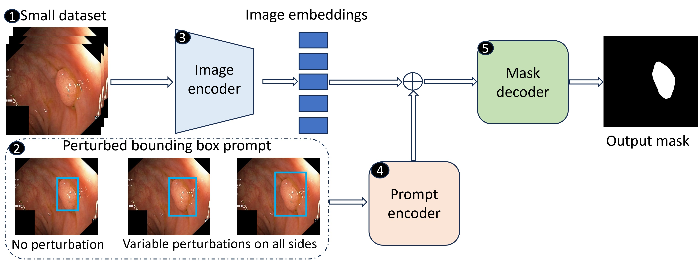

# PP-SAM

Official Pytorch implementation of the paper [PP-SAM: Perturbed Prompts for Robust Adaptation of Segment Anything Model for Polyp Segmentation](https://openaccess.thecvf.com/content/CVPR2024W/DEF-AI-MIA/papers/Rahman_PP-SAM_Perturbed_Prompts_for_Robust_Adaption_of_Segment_Anything_Model_CVPRW_2024_paper.pdf) published in CVPRW 2024. [arxiv](https://arxiv.org/abs/2405.16740)  
<br>
[Md Mostafijur Rahman<sup>1*</sup>](https://github.com/mostafij-rahman), [Mustafa Munir<sup>1</sup>](https://github.com/mmunir127), [Debesh Jha<sup>2</sup>](https://github.com/DebeshJha), [Ulas Bagci<sup>2</sup>](https://github.com/NUBagciLab), [Radu Marculescu<sup>1</sup>](https://radum.ece.utexas.edu/)
<p><sup>1</sup>The University of Texas at Austin, <sup>2</sup>Northwestern University, <sup>*</sup>Corresponding Author</p>

#### 🔍 **Check out our CVPR 2024 paper! [EMCAD](https://github.com/SLDGroup/EMCAD)** 
#### 🔍 **Check out our WACV 2024 paper! [G-CASCADE](https://github.com/SLDGroup/G-CASCADE)**
#### 🔍 **Check out our MIDL 2023 paper! [MERIT](https://github.com/SLDGroup/MERIT)** 
#### 🔍 **Check out our WACV 2023 paper! [CASCADE](https://github.com/SLDGroup/CASCADE)**

# Update
## ***We released the training code

## Fine-tuning pipeline

<p align="center">

</p>

## Citations

``` 
@inproceedings{rahman2024pp,
  title={PP-SAM: Perturbed Prompts for Robust Adaption of Segment Anything Model for Polyp Segmentation},
  author={Rahman, Md Mostafijur and Munir, Mustafa and Jha, Debesh and Bagci, Ulas and Marculescu, Radu},
  booktitle={Proceedings of the IEEE/CVF Conference on Computer Vision and Pattern Recognition},
  pages={4989--4995},
  year={2024}
}
```
